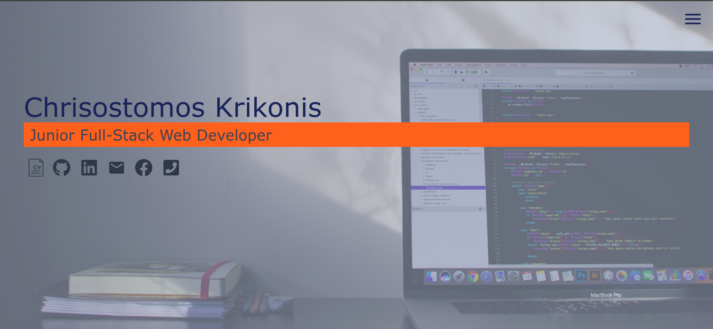

# My Portfolio Website

## Live @ [chrisostomos-krikonis.netlify.com](https://chrisostomos-krikonis.netlify.com)

### Responsive portfolio website to get to know me better, download my CV and see my projects on Github and Live Demos.

### You can also contact me by phone or e-mail and connect with me on social media.

This project was bootstrapped with [Create React App](https://github.com/facebook/create-react-app). This was also my first time I styled a website with [Sass](https://www.npmjs.com/package/node-sass) I am pretty amazed and I want to explore more of it.
